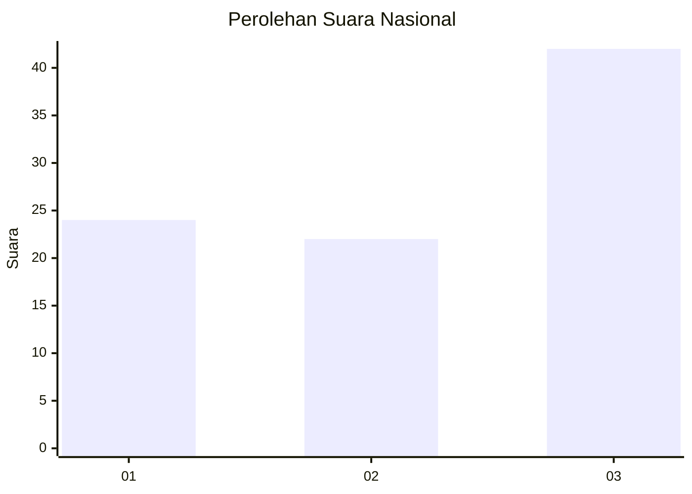
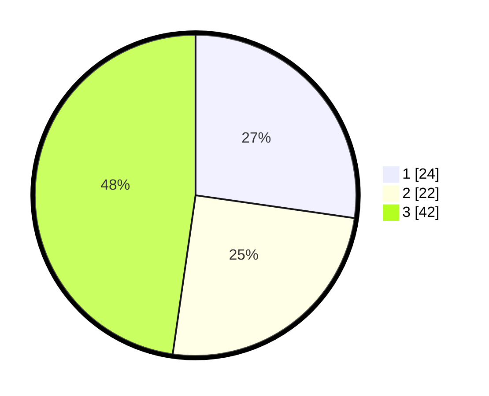

# Hasil

## Grafik

## Tabel

| No. | Nama Paslon    | Suara | Suara (raw) | Persentase |
|:--- |:-------------- | -----:| -----------:| ----------:|
| 1   | ANIES MUHAIMIN | 24    | [24][p-1]   | 27,27      |
| 2   | PRABOWO GIBRAN | 22    | [22][p-2]   | 25,00      |
| 3   | GANJAR MAHFUD  | 42    | [42][p-3]   | 47,73      |

[p-1]: https://github.com/gigit-pemilu/pemilu-2024/blob/main/pilpres/hitung-suara/sub/64-kalimantan-timur/sub/74-kota-bontang/sub/02-bontang-selatan/sub/1001-tanjung-laut/sub/015-tps/sub/paslon-1.txt
[p-2]: https://github.com/gigit-pemilu/pemilu-2024/blob/main/pilpres/hitung-suara/sub/64-kalimantan-timur/sub/74-kota-bontang/sub/02-bontang-selatan/sub/1001-tanjung-laut/sub/015-tps/sub/paslon-2.txt
[p-3]: https://github.com/gigit-pemilu/pemilu-2024/blob/main/pilpres/hitung-suara/sub/64-kalimantan-timur/sub/74-kota-bontang/sub/02-bontang-selatan/sub/1001-tanjung-laut/sub/015-tps/sub/paslon-3.txt

## Foto C Plano

https://sirekap-obj-formc.kpu.go.id/315e/pemilu/ppwp/64/74/02/10/01/6474021001015-20240220-164012--4dd9cfb2-6a19-42e9-986b-6c23b856254c.jpg

https://sirekap-obj-formc.kpu.go.id/315e/pemilu/ppwp/64/74/02/10/01/6474021001015-20240220-164248--05f9fb65-f12b-4949-8f42-5f639be844b6.jpg

https://sirekap-obj-formc.kpu.go.id/315e/pemilu/ppwp/64/74/02/10/01/6474021001015-20240220-164424--af5995c9-dcc7-49c4-8489-0b7d03879c66.jpg

## Metadata

| Key        | Value               |
| ---------- | ------------------- |
| Time Stamp | 2024-02-20 17:00:00 |

## DATA PEMILIH TETAP

Jumlah pemilih dalam DPT: **208**.
 * L: **106**.
 * P: **602**.

## DATA PENGGUNA HAK PILIH

Jumlah pengguna hak pilih dalam DPT: **565**.
 * L: **33**.
 * P: **86**.

Jumlah pengguna hak pilih dalam DPTb: **555**.
 * L: **8**.
 * P: **5**.

Jumlah pengguna hak pilih dalam DPK: **4**.
 * L: **6**.
 * P: **0**.

Jumlah pengguna hak pilih: **470**.
 * L: **84**.
 * P: **86**.

## JUMLAH SUARA SAH DAN TIDAK SAH

JUMLAH SELURUH SUARA SAH: **866**.

JUMLAH SUARA TIDAK SAH: **804**.

JUMLAH SELURUH SUARA SAH DAN SUARA TIDAK SAH: **870**.

